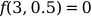
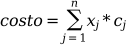

### Proyecto final de optimización
Vinicio Valbuena

~~~
- Cat Swarm Optimization (Continuo)

    * Pruebas

	- Sphere function
	- Matyas function
	- Beale  function
	- Booth  function
	- Himmelblau's function

- Binary Cat Swarm Optimization (Discreto)

    * Pruebas

	- Knapsack problem
	- Set cover problem
~~~

### class CSO
~~~

Parametros
==========
- func_test : func
    La funcion a minimizar / maximizar.

- lb : array
    limites inferiores de las variable[s].

- ub : array
    limites superiores de las variable[s].

Opcionales
==========
- maximize : bool
    Por defecto es False, se utiliza para indicar si se busca max o min
    la func_test.

- cats : int
    Numero de gatos.

- maxiter : int
    Numero maximo de iteraciones.

- mr : float
    Clasifica aleatoriamente a los gatos en búsqueda y rastreo.
    Intervalo [0, 1]. Ejemplo si el numero de gatos es 10 y el mr
    es 0.2, se eligiran 8 gatos aleatoriamente para ir al modo
    búsqueda ( seeking mode ) y los 2 restantes iran al modo de
    rastreo ( tracing mode ).

- smp : int
    Numero de posibles posiciones candidas aleatorias, ejemplo si
    se asigna a 5 cada gato generan 5 posiciones candidatas
    aleatorias para seleccionar la siguiente posicion.

- cdc : float
    Define cuantas dimenciones se van a modificar. Intervalo [0, 1].
    Ejemplo si el espacio de busqueda es de 5 dimensiones y cdc se
    asigna a 0.2, entonces para cada gato, cuatro dimensiones
    aleatorias de las cinco deben ser modificado y el otro permanece
    igual.

- srd : float
    Es la proporción de mutaciones para las dimensiones seleccionadas,
    es decir, define la cantidad de mutación y modificaciones para
    aquellas dimensiones que fueron seleccionadas por los cdc.
    Intervalo [0, 1].

- spc : bool
    Especifica si la posicion actual del gato se utiliza como posicion
    candidata.

- omega : float
    Factor para escalar la velocidad. Intervalo [0, 1].
~~~

### class BCSO
~~~

Parametros
==========
- func_test : func
    La funcion a minimizar / maximizar.

Opcionales
==========
- maximize : bool
    Por defecto es False, se utiliza para indicar si se busca max o min
    la func_test.

- dimension : int
    Numero de dimensiones.

- cats : int
    Numero de gatos.

- maxiter : int
    Numero maximo de iteraciones.

- mr : float
    Clasifica aleatoriamente a los gatos en búsqueda y rastreo.
    Intervalo [0, 1]. Ejemplo si el numero de gatos es 10 y el mr
    es 0.2, se eligiran 8 gatos aleatoriamente para ir al modo
    búsqueda ( seeking mode ) y los 2 restantes iran al modo de
    rastreo ( tracing mode ).

- smp : int
    Numero de posibles posiciones candidas aleatorias, ejemplo si
    se asigna a 5 cada gato generan 5 posiciones candidatas
    aleatorias para seleccionar la siguiente posicion.

- cdc : float
    Define cuantas dimenciones se van a modificar. Intervalo [0, 1].
    Ejemplo si el espacio de busqueda es de 5 dimensiones y cdc se
    asigna a 0.2, entonces para cada gato, cuatro dimensiones
    aleatorias de las cinco deben ser modificado y el otro permanece
    igual.

- pmo : float
    Probabilidad de mutación. Intervalo [0, 1].

- spc : bool
    Especifica si la posicion actual del gato se utiliza como posicion
    candidata.

- omega : float
    Factor para escalar la velocidad. Intervalo [0, 1].

- weight : float
    Peso aplicado a la velocidad. Intervalo [0, 1].

~~~

### Ejecutar una prueba [Linux]
~~~
$ git clone https://github.com/formatcom/optimization
$ cd optimization
$
$ python3 -m venv env
$ source env/bin/activate
$
$ pip install -r requirements.txt
$
$ cd cso
$ time python test_himmelblaus.py
~~~

### Resultados
~~~
Intel(R) Core(TM) i7-7500U CPU @ 2.70GHz

Cores:      2
Threads:    2
GFLOPS:  86.4
~~~

### CSO  | test_sphere.py | dimension 3

> Global minimum
>
> 

| n  | workers | threads | maxiter | cats | mr | smp | cdc | srd | spc | omega | time | result |
|--|--|--|--|--|--|--|--|--|--|--|--|--|
|  1  | 1 | 1 | 200 | 500 | 0.5 | 10 | 1 | 0.1 | False | 0.5 | 21.50s | [-0.01727896,  0.01340078,  0.01545751]| 
|  2  | 1 | 1 | 200 | 500 | 0.5 | 10 | 1 | 0.1 | False | 0.5 | 20.74s | [-0.00655391, -0.01099599, -0.00916707]| 
|  3  | 1 | 1 | 200 | 500 | 0.5 | 10 | 1 | 0.1 | False | 0.5 | 21.81s | [-0.01008625,  0.0043805 ,  0.00350937]| 
|  4  | 1 | 1 | 200 | 500 | 0.5 | 10 | 1 | 0.1 | False | 0.5 | 21.23s | [0.00489058, 0.01195485, 0.01197201]| 
~~~
~~~
| n  | workers | threads | maxiter | cats | mr | smp | cdc | srd | spc | omega | time | result |
|--|--|--|--|--|--|--|--|--|--|--|--|--|
|  1  | 3 | 1 | 200 | 500 | 0.5 | 10 | 1 | 0.1 | False | 0.5 | 34.16s |[-0.0037651545586679493, -0.0980244535660562, -0.039365020574868306] | 
|  2  | 3 | 1 | 200 | 500 | 0.5 | 10 | 1 | 0.1 | False | 0.5 | 32.52s |[-0.10029394465162955, -0.1069079281528893, 0.03301591599169547] | 
|  3  | 3 | 1 | 200 | 500 | 0.5 | 10 | 1 | 0.1 | False | 0.5 | 33.86s |[-0.034710058467875005, -0.02787973747516491, -0.030165981242425314]| 
|  4  | 3 | 1 | 200 | 500 | 0.5 | 10 | 1 | 0.1 | False | 0.5 | 33.23s |[-0.07637763697216123, -0.033123010180368485, -0.2403497711396711]| 
~~~
~~~
| n  | workers | threads | maxiter | cats | mr | smp | cdc | srd | spc | omega | time | result |
|--|--|--|--|--|--|--|--|--|--|--|--|--|
|  1  | 1 | 2 | 200 | 500 | 0.5 | 10 | 1 | 0.1 | False | 0.5 | 36.38s |[ 0.01158723, -0.00072514,  0.01012487]| 
|  2  | 1 | 2 | 200 | 500 | 0.5 | 10 | 1 | 0.1 | False | 0.5 | 36.17s |[-0.00458861,  0.00882006, -0.00258965]| 
|  3 | 1 | 2 | 200 | 500 | 0.5 | 10 | 1 | 0.1 | False | 0.5 | 35.77s |[-0.00374484, -0.0026737 , -0.01068693]| 
|  4 | 1 | 2 | 200 | 500 | 0.5 | 10 | 1 | 0.1 | False | 0.5 | 35.38s |[0.00505702, 0.00904414, 0.00739504]| 
~~~
~~~
| n  | workers | threads | maxiter | cats | mr | smp | cdc | srd | spc | omega | time | result |
|--|--|--|--|--|--|--|--|--|--|--|--|--|
|  1  | 3 | 2 | 200 | 500 | 0.5 | 10 | 1 | 0.1 | False | 0.5 | 51.98s |[-0.08379533035074181, -0.06389297258342667, -0.06388296120706652]| 
|  2  | 3 | 2 | 200 | 500 | 0.5 | 10 | 1 | 0.1 | False | 0.5 | 53.38s |[0.07298986318120004, 0.07497126941811505, 0.04351470646237898]| 
|  3  | 3 | 2 | 200 | 500 | 0.5 | 10 | 1 | 0.1 | False | 0.5 | 52.31s |[-0.07032199530452798, 0.17858643752770753, 0.09637068232979784]| 
|  4  | 3 | 2 | 200 | 500 | 0.5 | 10 | 1 | 0.1 | False | 0.5 | 52.40s |[0.05096983778438524, -0.06686564511500748, -0.041256651459480986]| 

### CSO  | test_matyas.py | dimension 2

> Global minimum
>
> 

| n  | workers | threads | maxiter | cats | mr | smp | cdc | srd | spc | omega | time | result |
|--|--|--|--|--|--|--|--|--|--|--|--|--|
|  1  | 1 | 1 | 200 | 500 | 0.5 | 10 | 1 | 0.1 | False | 0.5 | 21.70s | [-0.00219794, -0.00220389]| 
|  2  | 1 | 1 | 200 | 500 | 0.5 | 10 | 1 | 0.1 | False | 0.5 | 20.33s | [-0.00072755, -0.00084696]| 
|  3  | 1 | 1 | 200 | 500 | 0.5 | 10 | 1 | 0.1 | False | 0.5 | 20.36s | [-0.01181477, -0.01387464]| 
|  4  | 1 | 1 | 200 | 500 | 0.5 | 10 | 1 | 0.1 | False | 0.5 | 20.64s | [-0.00191806, -0.00043771]|
|  5  | 1 | 1 | 200 | 500 | 0.5 | 10 | 1 | 0.1 | False | 0.5 | 22.11s | [0.00341738, 0.00284375]|
|  6  | 1 | 1 | 200 | 500 | 0.5 | 10 | 1 | 0.1 | False | 0.5 | 20.57s | [-0.00542174, -0.00507472]|
|  7  | 1 | 1 | 200 | 500 | 0.5 | 10 | 1 | 0.1 | False | 0.5 | 20.88s | [-0.00160638, -0.0009822 ]|
|  8  | 1 | 1 | 200 | 500 | 0.5 | 10 | 1 | 0.1 | False | 0.5 | 20.48s | [0.0019583 , 0.00202374]|
|  9  | 1 | 1 | 200 | 500 | 0.5 | 10 | 1 | 0.1 | False | 0.5 | 21.34s | [0.00495406, 0.0041392 ]|
|  10  | 1 | 1 | 200 | 500 | 0.5 | 10 | 1 | 0.1 | False | 0.5 | 21.05s | [0.00926299, 0.00963383]|

### CSO  | test_beale.py | dimension 2

> Global minimum
>
> 

| n  | workers | threads | maxiter | cats | mr | smp | cdc | srd | spc | omega | time | result |
|--|--|--|--|--|--|--|--|--|--|--|--|--|
|  1  | 1 | 1 | 200 | 500 | 0.5 | 10 | 1 | 0.1 | False | 0.5 | 25.25s |[2.48073003, 0.22802043]| 
|  2  | 1 | 1 | 200 | 500 | 0.5 | 10 | 1 | 0.1 | False | 0.5 | 25.17s |[2.48186641, 0.228083  ]| 
|  3  | 1 | 1 | 200 | 500 | 0.5 | 10 | 1 | 0.1 | False | 0.5 | 25.19s |[2.48136496, 0.22847218]|
|  4  | 1 | 1 | 200 | 500 | 0.5 | 10 | 1 | 0.1 | False | 0.5 | 24.18s |[2.48085428, 0.22798683]| 
|  5  | 1 | 1 | 200 | 500 | 0.5 | 10 | 1 | 0.1 | False | 0.5 | 26.30s |[[2.48304593, 0.22873487]|
|  6  | 1 | 1 | 200 | 500 | 0.5 | 10 | 1 | 0.1 | False | 0.5 | 25.38s |[2.48374288, 0.229162  ]| 
|  7  | 1 | 1 | 200 | 500 | 0.5 | 10 | 1 | 0.1 | False | 0.5 | 25.27s |[2.48357631, 0.22865276]|
|  8  | 1 | 1 | 200 | 500 | 0.5 | 10 | 1 | 0.1 | False | 0.5 | 24.97s |[2.48230566, 0.22850661]|
|  9  | 1 | 1 | 200 | 500 | 0.5 | 10 | 1 | 0.1 | False | 0.5 | 24.02s |[2.48122373, 0.22839413]| 
|  10  | 1 | 1 | 200 | 500 | 0.5 | 10 | 1 | 0.1 | False | 0.5 | 24.89s |[2.47971806, 0.22798356]| 

### CSO  | test_booth.py | dimension 2

> Global minimum
>
> 

| n  | workers | threads | maxiter | cats | mr | smp | cdc | srd | spc | omega | time | result |
|--|--|--|--|--|--|--|--|--|--|--|--|--|
|  1  | 1 | 1 | 200 | 500 | 0.5 | 10 | 1 | 0.1 | False | 0.5 | 24.30s |[[1.00040217, 3.00210714]| 
|  2  | 1 | 1 | 200 | 500 | 0.5 | 10 | 1 | 0.1 | False | 0.5 | 23.35s |[1.0012424 , 2.99974706]| 
|  3  | 1 | 1 | 200 | 500 | 0.5 | 10 | 1 | 0.1 | False | 0.5 | 23.65s |[0.9997878 , 2.99946154]| 
|  4  | 1 | 1 | 200 | 500 | 0.5 | 10 | 1 | 0.1 | False | 0.5 | 23.22s |[[1.00035112, 3.00089043]| 
|  5  | 1 | 1 | 200 | 500 | 0.5 | 10 | 1 | 0.1 | False | 0.5 | 23.44s |[1.00036068, 3.00119816]|
|  6  | 1 | 1 | 200 | 500 | 0.5 | 10 | 1 | 0.1 | False | 0.5 | 23.10s |[1.00245263, 2.99791777]|
|  7  | 1 | 1 | 200 | 500 | 0.5 | 10 | 1 | 0.1 | False | 0.5 | 23.06s |[0.99943678, 3.00039696]|
|  8  | 1 | 1 | 200 | 500 | 0.5 | 10 | 1 | 0.1 | False | 0.5 | 24.73s |[0.99995004, 2.99909456]|
|  9  | 1 | 1 | 200 | 500 | 0.5 | 10 | 1 | 0.1 | False | 0.5 | 23.26s |[0.9994608 , 3.00350465]|
|  10  | 1 | 1 | 200 | 500 | 0.5 | 10 | 1 | 0.1 | False | 0.5 | 23.35s |[1.0014833 , 2.99804731]|

### CSO  | test_himmelblaus.py | dimension 2

> Global minimum
>
> 
>
> 
>
> 
>
> 

| n  | workers | threads | maxiter | cats | mr | smp | cdc | srd | spc | omega | time | result |
|--|--|--|--|--|--|--|--|--|--|--|--|--|
|  1  | 1 | 1 | 200 | 500 | 0.5 | 10 | 1 | 0.1 | False | 0.5 | 21.03s |[3.00125341, 1.99843419]|
|  2  | 1 | 1 | 200 | 500 | 0.5 | 10 | 1 | 0.1 | False | 0.5 | 22.75s |[-3.78007255, -3.28286918]|
|  3  | 1 | 1 | 200 | 500 | 0.5 | 10 | 1 | 0.1 | False | 0.5 | 21.56s |[ 3.58508285, -1.84841575]| 
|  4  | 1 | 1 | 200 | 500 | 0.5 | 10 | 1 | 0.1 | False | 0.5 | 21.92s |[3.00015874, 1.99900615]|
|  5  | 1 | 1 | 200 | 500 | 0.5 | 10 | 1 | 0.1 | False | 0.5 | 23.32s |[-3.77939371, -3.28467525]|
|  6  | 1 | 1 | 200 | 500 | 0.5 | 10 | 1 | 0.1 | False | 0.5 | 22.13s |[ 3.58466987, -1.84967224]|
|  7  | 1 | 1 | 200 | 500 | 0.5 | 10 | 1 | 0.1 | False | 0.5 | 21.92s |[-3.77704171, -3.28315489]|
|  8  | 1 | 1 | 200 | 500 | 0.5 | 10 | 1 | 0.1 | False | 0.5 | 23.54s |[ 3.58476494, -1.84803254]|
|  9  | 1 | 1 | 200 | 500 | 0.5 | 10 | 1 | 0.1 | False | 0.5 | 23.09s |[2.9992986, 1.9991622]| 
|  10  | 1 | 1 | 200 | 500 | 0.5 | 10 | 1 | 0.1 | False | 0.5 | 22.33s |[-2.8052767 ,  3.12988145]|

### BCSO  | test_set_cover_wiki.py | dimension 12

> Minimizar
>
> 
>
> El costo se penaliza si no cubre algun grupo/conjunto:
>
> 

| n  | workers | threads | maxiter | cats | mr | smp | cdc | pmo | spc | omega | weight | time | covering | optimum |
|--|--|--|--|--|--|--|--|--|--|--|--|--|--|--|
|  1  | 1 | 1 | 300 | 150| 0.5 | 20 | 0.7 | 0.1 | False | 0.5 | 1 |70.24s | [3, 5, 12]| 3.0 |
|  2  | 1 | 1 | 300 | 150| 0.5 | 20 | 0.7 | 0.1 | False | 0.5 | 1 |69.50s | [5, 8]| 2.0 |
|  3  | 1 | 1 | 300 | 150| 0.5 | 20 | 0.7 | 0.1 | False | 0.5 | 1 |70.09s | [5, 8]| 2.0 |
|  4  | 1 | 1 | 300 | 150| 0.5 | 20 | 0.7 | 0.1 | False | 0.5 | 1 |77.14s | [5, 8]| 2.0 |
|  5  | 1 | 1 | 300 | 150| 0.5 | 20 | 0.7 | 0.1 | False | 0.5 | 1 |76.25s |[1, 11, 12]| 3.0 |
|  6  | 1 | 1 | 300 | 150| 0.5 | 20 | 0.7 | 0.1 | False | 0.5 | 1 |73.33s |[5, 8]| 2.0 |
|  7  | 1 | 1 | 300 | 150| 0.5 | 20 | 0.7 | 0.1 | False | 0.5 | 1 |71.19s |[5, 8]| 2.0 |
|  8  | 1 | 1 | 300 | 150| 0.5 | 20 | 0.7 | 0.1 | False | 0.5 | 1 |72.14s |[5, 8]| 2.0 |
|  9  | 1 | 1 | 300 | 150| 0.5 | 20 | 0.7 | 0.1 | False | 0.5 | 1 |77.49s |[3, 5, 12]| 3.0 |
|  10  | 1 | 1 | 300 | 150| 0.5 | 20 | 0.7 | 0.1 | False | 0.5 | 1 |75.10s |[2, 7, 11]| 3.0 |

### BCSO  | test_set_cover_5.py | dimension 5

> Minimizar
>
> 
>
> El costo se penaliza si no cubre algun grupo/conjunto:
>
> 

| n  | workers | threads | maxiter | cats | mr | smp | cdc | pmo | spc | omega | weight | time | covering | optimum |
|--|--|--|--|--|--|--|--|--|--|--|--|--|--|--|
|  1  | 1 | 1 | 300| 150| 0.5 | 20 | 0.7 | 0.1 | False | 0.5 | 1 |34.16s | [2, 4, 5]| 41.0 |
|  2  | 1 | 1 | 300 | 150| 0.5 | 20 | 0.7 | 0.1 | False | 0.5 | 1 |33.12s| [2, 4, 5]| 41.0 |
|  3  | 1 | 1 | 300 | 150| 0.5 | 20 | 0.7 | 0.1 | False | 0.5 | 1 |35.08s| [2, 4, 5]| 41.0 |
|  4  | 1 | 1 | 300 | 150| 0.5 | 20 | 0.7 | 0.1 | False | 0.5 | 1 |33.26s| [2, 4, 5]| 41.0 |
|  5  | 1 | 1 | 300 | 150| 0.5 | 20 | 0.7 | 0.1 | False | 0.5 | 1 |34.37s| [2, 4, 5]| 41.0 |
|  6  | 1 | 1 | 300 | 150| 0.5 | 20 | 0.7 | 0.1 | False | 0.5 | 1 |36.08s| [2, 4, 5]| 41.0 |
|  7  | 1 | 1 | 300 | 150| 0.5 | 20 | 0.7 | 0.1 | False | 0.5 | 1 |36.19s| [2, 4, 5]| 41.0 |
|  8  | 1 | 1 | 300 | 150| 0.5 | 20 | 0.7 | 0.1 | False | 0.5 | 1 |35.66s| [2, 4, 5]| 41.0 |
|  9  | 1 | 1 | 300 | 150| 0.5 | 20 | 0.7 | 0.1 | False | 0.5 | 1 |36.31s| [2, 4, 5]| 41.0 |
|  10  | 1 | 1 | 300 | 150| 0.5 | 20 | 0.7 | 0.1 | False | 0.5 | 1 |35.29s| [2, 4, 5]| 41.0 |

### BCSO  | test_set_cover_100.py | dimension 100

> Minimizar
>
> 
>
> El costo se penaliza si no cubre algun grupo/conjunto:
>
> 

| n  | workers | threads | maxiter | cats | mr | smp | cdc | pmo | spc | omega | weight | time | covering | optimum |
|--|--|--|--|--|--|--|--|--|--|--|--|--|--|--|
|  1  | 1 | 2 | 12 | 100| 0.5 | 10 | 0.3 | 0.1 | False | 0.5 | 1 |513.03s |[1, 4, 5, 6, 7, 9, 10, 12, 13, 15, 16, 18, 19, 21, 22, 24, 25, 26, 27, 30, 32, 33, 34, 35, 36, 38, 40, 41, 42, 43, 44, 46, 47, 49, 50, 51, 52, 53, 54, 56, 57, 59, 61, 62, 63, 64, 65, 66, 67, 68, 70, 71, 73, 75, 76, 77, 78, 79, 80, 81, 82, 83, 85, 86, 88, 89, 90, 92, 94, 95, 96, 97]| 3857.0 |
|  2  | 1 | 2 | 12 | 100| 0.5 | 10 | 0.3 | 0.1 | False | 0.5 | 1 |533.97s |[1, 2, 3, 4, 5, 6, 7, 9, 10, 12, 13, 14, 16, 17, 18, 19, 21, 24, 26, 28, 30, 31, 33, 34, 35, 38, 39, 41, 42, 43, 46, 47, 48, 49, 50, 52, 53, 54, 57, 58, 62, 63, 64, 65, 66, 67, 68, 69, 70, 71, 72, 73, 75, 76, 77, 78, 79, 80, 81, 82, 83, 84, 88, 89, 90, 92, 93, 94, 95, 98, 99]| 3689.0 |
|  3  | 1 | 2 | 12 | 100| 0.5 | 10 | 0.3 | 0.1 | False | 0.5 | 1 |540.20s |[1, 2, 3, 4, 5, 6, 7, 9, 10, 12, 14, 16, 17, 21, 22, 26, 29, 30, 31, 32, 33, 34, 35, 37, 38, 39, 41, 43, 46, 47, 49, 50, 51, 52, 53, 54, 56, 58, 62, 63, 64, 65, 67, 70, 71, 75, 76, 77, 78, 79, 80, 81, 82, 83, 84, 85, 86, 88, 89, 91, 92, 93, 94, 95, 96, 97, 98, 99]| 3591.0 |
|  4  | 1 | 2 | 12 | 100| 0.5 | 10 | 0.3 | 0.1 | False | 0.5 | 1 |533.94s |[1, 2, 4, 5, 6, 7, 8, 9, 10, 11, 12, 14, 15, 16, 18, 19, 20, 21, 22, 24, 25, 26, 27, 31, 33, 34, 35, 37, 39, 41, 42, 43, 44, 46, 49, 50, 52, 53, 54, 55, 58, 61, 63, 65, 67, 68, 70, 71, 73, 75, 76, 77, 78, 79, 80, 81, 82, 83, 85, 86, 88, 90, 91, 92, 93, 94, 95, 97, 98, 99]| 3627.0 |

~~~
~~~
| n  | workers | threads | maxiter | cats | mr | smp | cdc | pmo | spc | omega | weight | time | covering | optimum |
|--|--|--|--|--|--|--|--|--|--|--|--|--|--|--|
|  1  | 1 | 1 | 12 | 100| 0.5 | 10 | 0.3 | 0.1 | False | 0.5 | 1 |550.42s |[1, 2, 3, 4, 5, 6, 7, 10, 12, 14, 15, 16, 17, 18, 19, 20, 21, 22, 24, 26, 27, 29, 31, 32, 33, 34, 35, 37, 38, 39, 41, 42, 43, 44, 46, 49, 50, 52, 53, 54, 56, 57, 61, 62, 63, 64, 65, 67, 70, 71, 73, 76, 77, 78, 79, 80, 82, 83, 84, 85, 86, 88, 89, 90, 91, 92, 93, 95, 96, 97, 98, 100]| 3826.0 |
|  2  | 1 | 1 | 12 | 100| 0.5 | 10 | 0.3 | 0.1 | False | 0.5 | 1 |541.44s |[3, 4, 5, 6, 7, 8, 10, 11, 12, 13, 14, 15, 16, 18, 19, 20, 22, 24, 25, 26, 27, 30, 31, 32, 33, 34, 37, 41, 42, 43, 46, 47, 50, 52, 53, 54, 61, 62, 63, 64, 65, 67, 68, 69, 70, 71, 72, 73, 75, 76, 77, 78, 79, 80, 81, 82, 83, 84, 86, 87, 88, 90, 92, 93, 94, 95, 96, 97, 98, 99]| 3797.0 |
|  3  | 1 | 1 | 12 | 100| 0.5 | 10 | 0.3 | 0.1 | False | 0.5 | 1 |510.48s |[1, 3, 4, 5, 6, 7, 9, 10, 12, 14, 16, 17, 18, 19, 20, 21, 26, 27, 28, 29, 31, 32, 33, 34, 35, 36, 37, 38, 39, 40, 41, 42, 43, 46, 48, 49, 50, 52, 53, 54, 55, 56, 57, 58, 60, 62, 63, 64, 65, 66, 67, 68, 69, 70, 75, 76, 77, 78, 80, 82, 83, 85, 86, 87, 88, 89, 91, 92, 95, 96, 98, 100]| 3987.0 |
|  4  | 1 | 1 | 12 | 100| 0.5 | 10 | 0.3 | 0.1 | False | 0.5 | 1 |524.29s |[1, 4, 5, 6, 7, 9, 10, 12, 13, 14, 16, 17, 18, 19, 22, 23, 25, 29, 31, 33, 34, 35, 37, 38, 40, 41, 42, 43, 45, 46, 49, 50, 52, 53, 54, 56, 58, 59, 60, 61, 63, 65, 66, 67, 70, 71, 72, 73, 76, 77, 78, 79, 80, 81, 82, 83, 84, 86, 87, 88, 89, 90, 92, 95, 96]| 3812.0 |

### BCSO  | test_knapsack_wiki.py | dimension 10

> Maximizar
>
> 
>
> El costo se penaliza si supera el limite establecido:
>
> 

| n  | workers | threads | maxiter | cats | mr | smp | cdc | pmo | spc | omega | weight | time | knapsack | optimum |
|--|--|--|--|--|--|--|--|--|--|--|--|--|--|--|
|  1  | 1 | 1 | 150 | 500| 0.5 | 20 | 0.7 | 0.7 | False | 0.5 | 1 |26.52s |[1, 4, 8]| 1270.0 |
|  2  | 1 | 1 | 150 | 500| 0.5 | 20 | 0.7 | 0.7 | False | 0.5 | 1 |28.34s |[1, 4, 8]| 1270.0 |
|  3  | 1 | 1 | 150 | 500| 0.5 | 20 | 0.7 | 0.7 | False | 0.5 | 1 |29.01s |[1, 4, 8]| 1270.0 |
|  4  | 1 | 1 | 150 | 500| 0.5 | 20 | 0.7 | 0.7 | False | 0.5 | 1 |29.00s |[1, 4, 8]| 1270.0 |

### BCSO  | f1_l-d_kp_10_269.py | dimension 10
> Dataset utilizado ref: [http://artemisa.unicauca.edu.co/~johnyortega/instances_01_KP/](http://artemisa.unicauca.edu.co/~johnyortega/instances_01_KP/) 

> Maximizar
>
> 
>
> El costo se penaliza si supera el limite establecido:
>
> 

| n  | workers | threads | maxiter | cats | mr | smp | cdc | pmo | spc | omega | weight | time | knapsack | optimum |
|--|--|--|--|--|--|--|--|--|--|--|--|--|--|--|
|  1  | 1 | 1 | 150 | 500| 0.5 | 20 | 0.7 | 0.7 | False | 0.5 | 1 |26.95s |[2, 3, 4, 8, 9, 10]| 295.0 |
|  2  | 1 | 1 | 150 | 500| 0.5 | 20 | 0.7 | 0.7 | False | 0.5 | 1 |25.88s |[2, 3, 4, 8, 9, 10]| 295.0 |
|  3  | 1 | 1 | 150 | 500| 0.5 | 20 | 0.7 | 0.7 | False | 0.5 | 1 |27.51s |[2, 3, 4, 8, 9, 10]| 295.0 |
|  4  | 1 | 1 | 150 | 500| 0.5 | 20 | 0.7 | 0.7 | False | 0.5 | 1 |28.03s |[2, 3, 4, 8, 9, 10]| 295.0 |
|  5  | 1 | 1 | 150 | 500| 0.5 | 20 | 0.7 | 0.7 | False | 0.5 | 1 |26.21s |[2, 3, 4, 8, 9, 10]| 295.0 |

### BCSO  | f2_l-d_kp_20_878.py | dimension 20
> Dataset utilizado ref: [http://artemisa.unicauca.edu.co/~johnyortega/instances_01_KP/](http://artemisa.unicauca.edu.co/~johnyortega/instances_01_KP/) 

> Maximizar
>
> 
>
> El costo se penaliza si supera el limite establecido:
>
> 

| n  | workers | threads | maxiter | cats | mr | smp | cdc | pmo | spc | omega | weight | time | knapsack | optimum |
|--|--|--|--|--|--|--|--|--|--|--|--|--|--|--|
|  1  | 1 | 1 | 150 | 500| 0.5 | 20 | 0.7 | 0.7 | False | 0.5 | 1 |43.97s |[1, 2, 3, 4, 5, 6, 7, 8, 9, 10, 11, 12, 13, 15, 17, 19, 20]| 1024.0 |
|  2  | 1 | 1 | 150 | 500| 0.5 | 20 | 0.7 | 0.7 | False | 0.5 | 1 |43.75s |[1, 2, 3, 4, 5, 6, 7, 8, 9, 10, 11, 12, 13, 15, 17, 19, 20]| 1024.0 |
|  3  | 1 | 1 | 150 | 500| 0.5 | 20 | 0.7 | 0.7 | False | 0.5 | 1 |45.72s|[1, 2, 3, 4, 5, 6, 7, 8, 9, 10, 11, 12, 13, 15, 17, 19, 20]| 1024.0 |
|  4  | 1 | 1 | 150 | 500| 0.5 | 20 | 0.7 | 0.7 | False | 0.5 | 1 |42.82s|[1, 2, 3, 4, 5, 6, 7, 8, 9, 10, 11, 12, 13, 15, 17, 19, 20]| 1024.0 |
|  5  | 1 | 1 | 150 | 500| 0.5 | 20 | 0.7 | 0.7 | False | 0.5 | 1 |43.48s|[1, 2, 3, 4, 5, 6, 7, 8, 9, 10, 11, 12, 13, 15, 17, 19, 20]| 1024.0 |

### BCSO  | f3_l-d_kp_4_20.py | dimension 4
> Dataset utilizado ref: [http://artemisa.unicauca.edu.co/~johnyortega/instances_01_KP/](http://artemisa.unicauca.edu.co/~johnyortega/instances_01_KP/) 

> Maximizar
>
> 
>
> El costo se penaliza si supera el limite establecido:
>
> 

| n  | workers | threads | maxiter | cats | mr | smp | cdc | pmo | spc | omega | weight | time | knapsack | optimum |
|--|--|--|--|--|--|--|--|--|--|--|--|--|--|--|
|  1  | 1 | 1 | 150 | 500| 0.5 | 20 | 0.7 | 0.7 | False | 0.5 | 1 |18.18s |[1, 2, 4]| 35.0 |
|  2  | 1 | 1 | 150 | 500| 0.5 | 20 | 0.7 | 0.7 | False | 0.5 | 1 |18.67s |[1, 2, 4]| 35.0 |
|  3  | 1 | 1 | 150 | 500| 0.5 | 20 | 0.7 | 0.7 | False | 0.5 | 1 |17.95s |[1, 2, 4]| 35.0 |
|  4  | 1 | 1 | 150 | 500| 0.5 | 20 | 0.7 | 0.7 | False | 0.5 | 1 |18.87s |[1, 2, 4]| 35.0 |
|  5  | 1 | 1 | 150 | 500| 0.5 | 20 | 0.7 | 0.7 | False | 0.5 | 1 |18.97s |[1, 2, 4]| 35.0 |

### BCSO  | f4_l-d_kp_4_11.py | dimension 4
> Dataset utilizado ref: [http://artemisa.unicauca.edu.co/~johnyortega/instances_01_KP/](http://artemisa.unicauca.edu.co/~johnyortega/instances_01_KP/) 

> Maximizar
>
> 
>
> El costo se penaliza si supera el limite establecido:
>
> 

| n  | workers | threads | maxiter | cats | mr | smp | cdc | pmo | spc | omega | weight | time | knapsack | optimum |
|--|--|--|--|--|--|--|--|--|--|--|--|--|--|--|
|  1  | 1 | 1 | 150 | 500| 0.5 | 20 | 0.7 | 0.7 | False | 0.5 | 1 |18.18s |[2, 4]| 23.0 |
|  2  | 1 | 1 | 150 | 500| 0.5 | 20 | 0.7 | 0.7 | False | 0.5 | 1 |18.85s |[2, 4]| 23.0 |
|  3  | 1 | 1 | 150 | 500| 0.5 | 20 | 0.7 | 0.7 | False | 0.5 | 1 |17.53s |[2, 4]| 23.0 |
|  4  | 1 | 1 | 150 | 500| 0.5 | 20 | 0.7 | 0.7 | False | 0.5 | 1 |19.14s |[2, 4]| 23.0 |
|  5  | 1 | 1 | 150 | 500| 0.5 | 20 | 0.7 | 0.7 | False | 0.5 | 1 |19.17s |[2, 4]| 23.0 |

### BCSO  | f5_l-d_kp_15_375.py | dimension 15
> Dataset utilizado ref: [http://artemisa.unicauca.edu.co/~johnyortega/instances_01_KP/](http://artemisa.unicauca.edu.co/~johnyortega/instances_01_KP/) 

> Maximizar
>
> 
>
> El costo se penaliza si supera el limite establecido:
>
> 

| n  | workers | threads | maxiter | cats | mr | smp | cdc | pmo | spc | omega | weight | time | knapsack | optimum |
|--|--|--|--|--|--|--|--|--|--|--|--|--|--|--|
|  1  | 1 | 1 | 150 | 500| 0.5 | 20 | 0.7 | 0.7 | False | 0.5 | 1 |82.99s|[3, 5, 7, 8, 10, 11, 12, 14, 15]| 481.069368 |
|  2  | 1 | 1 | 150 | 500| 0.5 | 20 | 0.7 | 0.7 | False | 0.5 | 1 |79.21s|[3, 5, 7, 8, 10, 11, 12, 14, 15]| 481.069368 |
|  3  | 1 | 1 | 150 | 500| 0.5 | 20 | 0.7 | 0.7 | False | 0.5 | 1 |87.43s|[3, 5, 7, 8, 10, 11, 12, 14, 15]| 481.069368 |
|  4  | 1 | 1 | 150 | 500| 0.5 | 20 | 0.7 | 0.7 | False | 0.5 | 1 |86.48s|[3, 5, 7, 8, 10, 11, 12, 14, 15]| 481.069368 |
|  5  | 1 | 1 | 150 | 500| 0.5 | 20 | 0.7 | 0.7 | False | 0.5 | 1 |85.91s|[3, 5, 7, 8, 10, 11, 12, 14, 15]| 481.069368 |

### BCSO  | f6_l-d_kp_10_60.py | dimension 10
> Dataset utilizado ref: [http://artemisa.unicauca.edu.co/~johnyortega/instances_01_KP/](http://artemisa.unicauca.edu.co/~johnyortega/instances_01_KP/) 

> Maximizar
>
> 
>
> El costo se penaliza si supera el limite establecido:
>
> 

| n  | workers | threads | maxiter | cats | mr | smp | cdc | pmo | spc | omega | weight | time | knapsack | optimum |
|--|--|--|--|--|--|--|--|--|--|--|--|--|--|--|
|  1  | 1 | 1 | 150 | 500| 0.5 | 20 | 0.7 | 0.7 | False | 0.5 | 1 |56.93s|[3, 4, 6, 7, 8, 9, 10]| 52.0 |
|  2  | 1 | 1 | 150 | 500| 0.5 | 20 | 0.7 | 0.7 | False | 0.5 | 1 |61.17s|[3, 4, 6, 7, 8, 9, 10]| 52.0 |
|  3  | 1 | 1 | 150 | 500| 0.5 | 20 | 0.7 | 0.7 | False | 0.5 | 1 |60.79s|[3, 4, 6, 7, 8, 9, 10]| 52.0 |
|  4  | 1 | 1 | 150 | 500| 0.5 | 20 | 0.7 | 0.7 | False | 0.5 | 1 |59.16s|[3, 4, 6, 7, 8, 9, 10]| 52.0 |
|  5  | 1 | 1 | 150 | 500| 0.5 | 20 | 0.7 | 0.7 | False | 0.5 | 1 |58.70s|[3, 4, 6, 7, 8, 9, 10]| 52.0 |

### BCSO  | f7_l-d_kp_7_50.py | dimension 7
> Dataset utilizado ref: [http://artemisa.unicauca.edu.co/~johnyortega/instances_01_KP/](http://artemisa.unicauca.edu.co/~johnyortega/instances_01_KP/) 

> Maximizar
>
> 
>
> El costo se penaliza si supera el limite establecido:
>
> 

| n  | workers | threads | maxiter | cats | mr | smp | cdc | pmo | spc | omega | weight | time | knapsack | optimum |
|--|--|--|--|--|--|--|--|--|--|--|--|--|--|--|
|  1  | 1 | 1 | 150 | 500| 0.5 | 20 | 0.7 | 0.7 | False | 0.5 | 1 |45.35s|[1, 4]| 107.0 |
|  2  | 1 | 1 | 150 | 500| 0.5 | 20 | 0.7 | 0.7 | False | 0.5 | 1 |43.79s|[1, 4]| 107.0 |
|  3  | 1 | 1 | 150 | 500| 0.5 | 20 | 0.7 | 0.7 | False | 0.5 | 1 |43.87s|[1, 4]| 107.0 |
|  4  | 1 | 1 | 150 | 500| 0.5 | 20 | 0.7 | 0.7 | False | 0.5 | 1 |43.31s|[1, 4]| 107.0 |
|  5  | 1 | 1 | 150 | 500| 0.5 | 20 | 0.7 | 0.7 | False | 0.5 | 1 |44.93s|[1, 4]| 107.0 |

### BCSO  | f8_l-d_kp_23_10000.py | dimension 23
> Dataset utilizado ref: [http://artemisa.unicauca.edu.co/~johnyortega/instances_01_KP/](http://artemisa.unicauca.edu.co/~johnyortega/instances_01_KP/) 

> Maximizar
>
> 
>
> El costo se penaliza si supera el limite establecido:
>
> 

| n  | workers | threads | maxiter | cats | mr | smp | cdc | pmo | spc | omega | weight | time | knapsack | optimum |
|--|--|--|--|--|--|--|--|--|--|--|--|--|--|--|
|  1  | 1 | 1 | 150 | 500| 0.5 | 20 | 0.7 | 0.7 | False | 0.5 | 1 |122.44s|[1, 2, 3, 4, 5, 6, 7, 10, 14, 16, 17, 18]| 9759.0 |
|  2  | 1 | 1 | 150 | 500| 0.5 | 20 | 0.7 | 0.7 | False | 0.5 | 1 |127.00s|[1, 2, 3, 4, 6, 7, 8, 13, 14, 16, 17]| 9759.0 |
|  3  | 1 | 1 | 150 | 500| 0.5 | 20 | 0.7 | 0.7 | False | 0.5 | 1 |120.35s|[1, 2, 3, 4, 6, 7, 8, 10, 13, 14, 17, 18]| 9750.0 |
|  4  | 1 | 1 | 150 | 500| 0.5 | 20 | 0.7 | 0.7 | False | 0.5 | 1 |115.06s|[1, 2, 3, 4, 5, 6, 7, 8, 11, 14, 15, 16]| 9761.0 |
|  5  | 1 | 1 | 150 | 500| 0.5 | 20 | 0.7 | 0.7 | False | 0.5 | 1 |122.68s|[1, 2, 3, 4, 5, 6, 7, 10, 11, 13, 15, 16]| 9758.0 |
~~~
~~~
| n  | workers | threads | maxiter | cats | mr | smp | cdc | pmo | spc | omega | weight | time | knapsack | optimum |
|--|--|--|--|--|--|--|--|--|--|--|--|--|--|--|
|  1  | 1 | 1 | 150 | 500| 0.5 | 20 | 0.7 | 0.7 | False | **0.01** | 1 |127.06s|[1, 2, 3, 4, 5, 6, 7, 8, 14, 16, 17]| 9766.0 |
|  2  | 1 | 1 | 150 | 500| 0.5 | 20 | 0.7 | 0.7 | False | 0.01 | 1 |124.10s|[1, 2, 3, 4, 5, 6, 8, 10, 15, 16, 17]| 9764.0 |
|  3  | 1 | 1 | 150 | 500| 0.5 | 20 | 0.7 | 0.7 | False | 0.01 | 1 |124.30s|[1, 2, 3, 4, 5, 6, 7, 10, 15, 16, 17, 18]| 9759.0 |
|  4  | 1 | 1 | 150 | 500| 0.5 | 20 | 0.7 | 0.7 | False | 0.01 | 1 |119.14s|[1, 2, 3, 4, 5, 6, 7, 9, 11, 16, 17]| 9763.0 |
|  5  | 1 | 1 | 150 | 500| 0.5 | 20 | 0.7 | 0.7 | False | 0.01 | 1 |125.78s|[1, 2, 3, 4, 5, 6, 7, 8, 15, 16, 17]| 9766.0 |
~~~
~~~
| n  | workers | threads | maxiter | cats | mr | smp | cdc | pmo | spc | omega | weight | time | knapsack | optimum |
|--|--|--|--|--|--|--|--|--|--|--|--|--|--|--|
|  1  | 1 | 1 | 150 | 500| 0.5 | 20 | 0.7 | 0.7 | **True** | **0.001** | 1 |126.24s|[1, 2, 3, 4, 5, 6, 7, 8, 11, 16, 17]| **9767.0** |
|  2  | 1 | 1 | 150 | 500| 0.5 | 20 | 0.7 | 0.7 | True | 0.001| 1 |125.19s|[1, 2, 3, 4, 5, 6, 7, 8, 14, 16, 17]| 9766.0 |
|  3  | 1 | 1 | 150 | 500| 0.5 | 20 | 0.7 | 0.7 | True | 0.001| 1 |125.67s|[1, 2, 3, 4, 5, 6, 7, 8, 10, 11, 14, 16]| 9762.0 |
|  4  | 1 | 1 | 150 | 500| 0.5 | 20 | 0.7 | 0.7 | True | 0.001| 1 |124.16s|[1, 2, 3, 4, 5, 6, 7, 8, 10, 16, 17]| **9767.0** |
|  5  | 1 | 1 | 150 | 500| 0.5 | 20 | 0.7 | 0.7 | True | 0.001| 1 |125.83s|[1, 2, 3, 4, 5, 6, 7, 11, 12, 13, 16]| 9759.0 |

### BCSO  | f9_l-d_kp_5_80.py | dimension 5
> Dataset utilizado ref: [http://artemisa.unicauca.edu.co/~johnyortega/instances_01_KP/](http://artemisa.unicauca.edu.co/~johnyortega/instances_01_KP/) 

> Maximizar
>
> 
>
> El costo se penaliza si supera el limite establecido:
>
> 

| n  | workers | threads | maxiter | cats | mr | smp | cdc | pmo | spc | omega | weight | time | knapsack | optimum |
|--|--|--|--|--|--|--|--|--|--|--|--|--|--|--|
|  1  | 1 | 1 | 150 | 500| 0.5 | 20 | 0.7 | 0.7 | False | 0.5 | 1 |36.35s|[1, 2, 3, 4]| 130.0 |
|  2  | 1 | 1 | 150 | 500| 0.5 | 20 | 0.7 | 0.7 | False | 0.5 | 1 |37.97s|[1, 2, 3, 4]| 130.0 |
|  3  | 1 | 1 | 150 | 500| 0.5 | 20 | 0.7 | 0.7 | False | 0.5 | 1 |34.76s|[1, 2, 3, 4]| 130.0 |
|  4  | 1 | 1 | 150 | 500| 0.5 | 20 | 0.7 | 0.7 | False | 0.5 | 1 |34.38s|[1, 2, 3, 4]| 130.0 |
|  5  | 1 | 1 | 150 | 500| 0.5 | 20 | 0.7 | 0.7 | False | 0.5 | 1 |34.49s|[1, 2, 3, 4]| 130.0 |

### BCSO  | f10_l-d_kp_20_879.py | dimension 20
> Dataset utilizado ref: [http://artemisa.unicauca.edu.co/~johnyortega/instances_01_KP/](http://artemisa.unicauca.edu.co/~johnyortega/instances_01_KP/) 

> Maximizar
>
> 
>
> El costo se penaliza si supera el limite establecido:
>
> 

| n  | workers | threads | maxiter | cats | mr | smp | cdc | pmo | spc | omega | weight | time | knapsack | optimum |
|--|--|--|--|--|--|--|--|--|--|--|--|--|--|--|
|  1  | 1 | 1 | 150 | 500| 0.5 | 20 | 0.7 | 0.7 | False | 0.5 | 1 |103.38s|[1, 2, 3, 4, 5, 6, 7, 8, 9, 11, 12, 13, 14, 16, 18, 19, 20]| 1025.0 |
|  2  | 1 | 1 | 150 | 500| 0.5 | 20 | 0.7 | 0.7 | False | 0.5 | 1 |110.25s|[1, 2, 3, 4, 5, 6, 7, 8, 9, 11, 12, 13, 14, 16, 18, 19, 20]| 1025.0 |
|  3  | 1 | 1 | 150 | 500| 0.5 | 20 | 0.7 | 0.7 | False | 0.5 | 1 |102.77s|[1, 2, 3, 4, 5, 6, 7, 8, 9, 11, 12, 13, 14, 16, 18, 19, 20]| 1025.0 |
|  4  | 1 | 1 | 150 | 500| 0.5 | 20 | 0.7 | 0.7 | False | 0.5 | 1 |114.46s|[1, 2, 3, 4, 5, 6, 7, 8, 9, 11, 12, 13, 14, 16, 18, 19, 20]| 1025.0 |
|  5  | 1 | 1 | 150 | 500| 0.5 | 20 | 0.7 | 0.7 | False | 0.5 | 1 |102.43s|[1, 2, 3, 4, 5, 6, 7, 8, 9, 11, 12, 13, 14, 16, 18, 19, 20]| 1025.0 |

### Referencias
~~~
- https://www.researchgate.net/publication/221419703_Cat_Swarm_Optimization
- https://downloads.hindawi.com/journals/cin/2020/4854895.pdf
- https://www.researchgate.net/publication/258510186_Discrete_binary_cat_swarm_optimization_algorithm
- https://www.researchgate.net/publication/282307581_A_Binary_Cat_Swarm_Optimization_Algorithm_for_the_Non-Unicost_Set_Covering_Problem
- https://www.ncbi.nlm.nih.gov/pmc/articles/PMC6393876/
- http://opac.pucv.cl/pucv_txt/txt-6500/UCD6603_01.pdf
- https://en.wikipedia.org/wiki/Test_functions_for_optimization
- https://es.wikipedia.org/wiki/Problema_del_conjunto_de_cobertura
- https://en.wikipedia.org/wiki/Set_cover_problem
~~~
